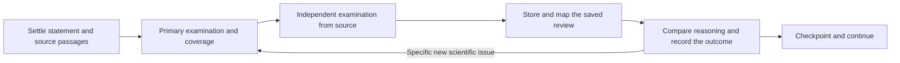

# Proof audit workflow design

Status: implemented in the current working tree through the [revision handoff](proofcheck-agent-workflow-revision-handoff.md); see its validation note for actual test coverage and remaining limitations. Date: October 2, 2026. Baseline: stat-proof-check and paper_core 2.3.7.

The [agent-independent revision handoff](proofcheck-agent-workflow-revision-handoff.md) turns this design into implementation packages and acceptance criteria, including hosts without subagents or resumable sessions.

## Design decision

Organize execution around a coherent proof and the person or model examining it. Keep the separate records needed for rigor, but stop treating their record types as separate worker jobs.

One primary owner carries a proof through source comparison, primary examination, coverage and later reconciliation. The coordinator is the default owner; delegation is useful when a substantial coherent proof benefits from its own context. Independent examination uses a separate source-only context. Reconciliation compares the two examinations and investigates specific unresolved differences; it does not routinely commission a third complete examination.

The default sequence is **prepare the exact proof, finish its primary examination and coverage, obtain independent examination, integrate and reconcile, then move on**. Different proofs can occupy different stages at once. A proof gap is an audit result; completion does not require repairing the manuscript or making all reviewers report support.

These are operating rules for the existing system, not new database phases, certificates or approval gates. The principal changes are a simpler default path and clearer generated instructions and command results.

## What Claude is spending effort on

The October 1 RF-HTE run mixed five kinds of work:

| Work | Necessary purpose | Source of avoidable repetition |
| --- | --- | --- |
| Read and represent the source | Recover exact formulas, assumptions, proof boundaries and dependencies | Multiple fresh workers reread shared definitions and instructions; detailed graph authoring occurs far ahead of integration |
| Examine the mathematics | Check supplier applications, intermediate deductions and final conclusions | Separate workers are launched for source comparison, primary checking, globals and reconciliation even when an existing context can do the work |
| Record the examination | Save evidence, conditions, judgments and coverage | The model writes helper scripts and reconstructs response shapes or bookkeeping fields |
| Connect independent reasoning to the graph | Establish which source-based judgment concerns which stored argument or inference | Every extra local judgment creates mapping and later reconciliation work; identity problems can look like requests for a new examination |
| Recover after changes or interruption | Keep evidence applicable and preserve completed work | Reviews start before transcription settles; later corrections reopen them; returned files can remain outside accepted database state |

In that run, 77 worker-launch attempts replaced the older run's eight. Eleven statement corrections at revision 82 reopened 31 current obligations, and six independent reviews needed renewal. At the final interruption, saved responses already contained complete result rows for 51 missing primary obligations. These observations establish substantial coordination and recovery work. They do not measure a percentage of runtime wasted, and they do not make every extra examination unnecessary.

The first approximately 49 minutes preceded the first delegated source-comparison wave. During that interval Claude read and rendered sources, built the detailed graph, wrote helpers, prepared a checkpoint and arranged qualification. Later, source comparison and independent review overlapped, followed by mapping and delayed corrections. The work did not consist of one steadily advancing proof examination.

The [audit report](../../audit-reports/audit-v2.3.7-2026-10-01/audit.md) and its transcript/database companions contain the evidence and causal limitations. Both comparison runs used the same reported Claude model and effort, but different papers and proof availability.

## Define the unit and its owner

A proof unit is an exact conclusion together with one written argument, its applicable setup and all relevant source passages. It maps to existing items or parts, arguments, groups, uses and reviewed boundaries. It is not a new storage object. Distinct written routes remain distinct units. A long proof can use meaningful intermediate conclusions, with explicit final integration.

Start with a manuscript-wide inventory of required results, sources and known dependencies. Develop detailed intermediate records as each proof is examined, instead of requiring a fully elaborated step graph for the whole paper before checking can begin. Preserve undispatched prerequisites and written alternatives in the inventory. Later discoveries extend it; the final inventory comparison against the manuscript still matters.

An owner keeps the relevant mathematics in one continuing context across several tool calls or packets where available. Ownership is a responsibility that can pass to a successor through saved, role-appropriate evidence when a context cannot resume. Ownership does not grant new write permissions. When a delegated primary worker finds a source mismatch, it describes the correction through the permitted output; the coordinator commits the source-grounded edit and returns an authorized updated assignment to the same worker where continuity is available. Independent responses always retain their actual separate provenance; a replacement examiner authors a new response and cannot claim the previous author's continuity.

Group related assignments when shared definitions and source passages make that useful. The number of packet files, result rows or database records does not determine the number of model calls. A worker must still save each packet's response with its original identity.

## Normal progress through one proof

The return arrow means targeted examination of the affected issue. It does not mean restarting the proof or automatically asking both roles to repeat their work. If new independent examination is necessary, preserve actual continuity or obtain a fresh qualified context as appropriate.

| Stage | Responsible context and output | Condition for moving forward |
| --- | --- | --- |
| Settle the representation | The owner compares the exact statement, setup, intermediate claims and complete source passages with the paper; coordinator commits identified corrections and reviewed boundaries | No identified correction affecting the proposed review inputs remains pending. Source limitations are explicit |
| Perform the primary examination | The same owner checks applications, deductions, cases and composition; saves reasoning, findings and coverage through the existing interfaces | The assigned work has an explicit outcome and evidence. Coverage needed for final composition is saved with it or before it |
| Obtain independent examination | A qualified separate context receives neutral source material, exact targets and its response scaffold | The written route is actually examined. Distinct limitations, local defects and counterexamples are retained |
| Integrate and reconcile | Coordinator stores the unchanged response and maps it; the owner compares the primary and independent reasoning and conditions | Required examinations and reconciliation are recorded and current, or a specific remaining issue is identified |
| Deliver progress | Coordinator updates the working report and remaining-work information | The user can distinguish completed examination, saved output awaiting integration, and work still needed |

Default to completing the local primary pass before independent dispatch because that pass often discovers representation errors and omitted passages. This is not a new core eligibility gate. An early independent examination can be useful for a specific unresolved scientific question once its exact target and available source are clear. Such a choice should have that purpose; overlapping unfinished transcription with routine independent dispatch should not be the default.

Readiness is local. A correction to proof B should not stop independent review of settled proof A. Nor must every supplier's own audit finish before an application can be examined under its explicitly stated premise. Preserve the difference between a checked conditional implication and an established theorem. Missing source remains a disclosed limitation and unfinished required work where applicable; it does not authorize dropping the target.

Parallelism should support this sequence. While an independent worker reviews A, the primary owner can examine B. Integrate returned responses before repeatedly expanding the worker pool. Use actual context needs and available execution capacity, rather than a fixed quota of workers or an attempt to fill every available slot.

## Make the independent review easy to integrate

Independent checking must cover every substantive inference, including missing dependencies. It need not create one independent record for each primary graph node.

The usual output is a coherent route judgment containing the full reasoning, plus separately actionable judgments where needed. A local false claim, a distinct gap, different cases with different outcomes, or a different route may deserve its own record. Routine supported calculations can remain inside the route reasoning. Neither a row-count cap nor merging different outcomes is acceptable.

The independent worker describes the conclusion and written route using source locations. It does not receive the primary proof graph to make mapping easier. The coordinator maps genuine correspondences privately. A missing graph inference requires a source-grounded refinement; a wrong judgment kind requires correction by its author. Neither permits silently changing the reviewer's scientific content.

One independent worker may examine a coherent group of source-only assignments sharing setup. It can reuse its own source context while preserving separate packet responses. A context exposed to primary judgments cannot subsequently be relabeled as blind independent review.

## Distinguish the reasons for going back

| What happened | Next operation | Reason to call a mathematical checker again |
| --- | --- | --- |
| The review is saved but its source targets need graph identities | Map the existing response using private coordinator context | None solely to supply database identities |
| A coordinator envelope has a wrong administrative field | Correct the envelope, preserving worker bytes and actual provenance; use a fresh request ID when required | None for an envelope-only correction |
| A worker response has a wrong kind, scientific wording or incompatible targets | Obtain a corrected response from its author, preserving the original and actual continuity | Address the named correction, rather than routinely repeat the whole examination |
| The saved statement omitted a source assumption or a proof passage was missed | Correct the representation, then inspect changed-input diagnostics | Reexamine the affected mathematical inputs and dependent conclusions |
| Additional neutral source is needed | Extend the independent assignment through the existing mechanism | The reviewer must actually examine the added material |
| The paper's proof has a gap or a refuted intermediate claim | Save the defect and reconcile the examinations | Only a specific unresolved scientific question warrants more work; a negative outcome alone does not |
| An interrupted submission remains `received` | Inspect and replay the exact saved attempt | None unless subsequent scientific changes require it |
| A valid output file exists but has not been submitted | Check its identity, provenance and current applicability, then submit or follow its specific recovery path | None merely because the database still lists the obligation as missing |

Changing a scientific claim requires authored examination. Software may fill deterministic structure or administrative fields, but must not invent scope, evidence, reviewer identity, exposure, conditions, agreement or a favorable outcome. Existing freshness, whole-response acceptance and reconciliation rules remain authoritative.

Repeated audit cycles should stop when the actual issue is already characterized. For example, if both reviewers find the same unsupported limit interchange, record the gap with their reasons. Do not keep generating repairs until the route can be labeled supported. A proposed repaired proof is separate work with its own provenance and review requirements.

## A concrete example of the change

In the observed run, independent review began while source comparisons were still running. The coordinator later corrected Theorem 3.1's saved variance-bound and bias-to-standard-error statements. Reviews tied to the earlier representation then needed renewal.

Under this design, the owner checks those statements and their hypotheses while preparing and examining Theorem 3.1. Identified mismatches are committed before its routine independent dispatch. The independent reviewer receives the corrected exact source target and complete source passages, without the primary opinion. Its response is then mapped and compared. Other settled proofs continue during this work.

If a missing hypothesis is genuinely missing from the manuscript, it stays missing from the audited assertion. The owner records a possible gap instead of silently strengthening the statement. This is how the design reduces corrections to the audit representation without turning proof checking into manuscript repair.

## Small interface changes that make the path usable

Repeating the above rules in more prose is insufficient. Several of them already appear in current references. Three targeted changes should make the existing tools lead the coordinator through the intended path.

### Generate usable assignment guidance

Extend the existing guidance with a compact primary task table: task ID, target label, check kind and result variant. Generate actual blank coverage and finding row templates from the current contract, including required nullable fields. Their classifications, evidence links, reasoning and outcomes remain for the examiner to author.

Keep explanatory labels outside the strict response JSON. Retain the existing packet, response scaffold and role-specific delivery lists. Independent delivery must not acquire the primary task table, canonical decomposition, expected outcomes or coordinator recovery inventory. Reuse captured neutral page images and relevant source context rather than repeatedly creating new extraction helpers.

### Return the next applicable operation

Replace generic next steps with case-specific guidance backed by the command's actual result. For example, `submit_work` currently returns `prepare current remaining work` even when a saved independent response has pending source targets. In that case the normal next operation is mapping the saved response. Missing evidence, wrong kinds and changed scientific inputs require different actions.

For an explicit task request that selects prerequisites, show the requested tasks, the selected prerequisites and their relationship. For a size failure, show a supported bounded retry when available, or the specific context that cannot fit. Do not promise that an estimated byte size is sufficient or silently truncate mathematical context.

Derive diagnostic categories where the result is produced, rather than infer them by matching English error messages. Preserve immutable historical receipts; current inspection can provide updated action guidance separately. These are additional explanations and actions, not new acceptance states.

### Show saved work before proposing new examinations

Extend the existing coordinator inspection and mapping assistance with a bounded current inventory: original packet/request/response identities, reviewer provenance, current acceptance, mapped and pending judgments, changed inputs, and the next operation. Separate the historical intake receipt from the current response state.

Database inspection alone cannot discover a worker file that was never submitted. The coordinator must also inspect the explicitly known assignment and delivery directories. If this directory inventory is automated, limit it to those named directories, match packet identities and exact response hashes to intake history, and treat files as recovery candidates rather than accepted evidence. Do not infer anything from a folder's descriptive name. The October 1 audit found some folder names differed from their actual task contents.

Use existing inspection APIs and assignment artifacts for these views. Do not add a second task database, autonomous dispatcher, quota manager or new managed-workflow wrapper for this revision. The older automatic-workflow proposal remains separate and unimplemented.

## Where the specification belongs

Revise the existing coordinator and controller workflow references around one short normal path and the correction table. Replace overlapping explanations instead of appending another mandatory manual. The entrypoint should state the default ownership and point to that path. The primary and independent briefs should agree with the generated guidance.

Implementation belongs in the maintained `shared/paper_core` assistance, controller, inspection and mapping code where needed. Keep scientific schemas and stored audit history compatible. Shared-core changes must be rebuilt into both skill bundles and checked for Proof Graphify compatibility. This proposal does not change Proof Graphify's purpose or require it to precede a proof audit.

At startup, arrange one qualification for the actual reviewer configuration and reuse it while that configuration remains applicable. Run global examinations after substantive local edits settle. Report completed, limited and unfinished audits honestly; disabling required independence is not a way to finish a full proof-check task.

## How to validate the design

First check specific behavior with small existing-core fixtures:

- A valid independent response awaiting mapping leads to mapping, without a new examination. Partial mapping remains visibly pending; completing it updates the current view without rewriting the original receipt.
- A mixed primary response with checks, coverage and findings can be authored from generated artifacts without guessing missing fields. Scientific answers remain blank in generated templates.
- A requested task waiting on a supplier shows that prerequisite relationship and returns to the original task afterward.
- An envelope-only correction preserves scientific response bytes; a real statement or boundary change still requires the affected examination.
- Saved unsubmitted files are offered for recovery without being counted complete. Unknown or incompatible files remain unresolved.
- A negative examination and an unresolved disagreement can be recorded without manufacturing agreement or an endless repair loop. Existing release requirements still apply.

Then exercise a realistic proof containing a transcription correction, a genuine gap, related assignments and an interruption. Observe whether one continuing primary context and independent source-only review can carry it through storage, mapping, reconciliation and delivery. Finally run the same RF-HTE paper and supplement with the same declared scope and reviewer configuration.

Record launches by purpose, why examinations were repeated, saved outputs awaiting integration, accepted/current obligations and report revision. Record process elapsed separately from active model time, leaving active time unknown when unmeasured. Check mathematical scope and preserved negative findings alongside efficiency. Do not use fewer records, fewer findings or a completed shell process as the success criterion, and do not promise a particular runtime before that test.
