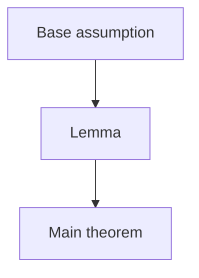

# Proof Dependency Record

Ledger `direct_dependencies` and `DEPENDENCY_REGISTRY.json` are canonical for
proof dependencies. Use `closure_contract_version: 2`, and bind the registry
review to the current source snapshot, theorem-inventory hash, and exact in-scope
unit list. `METHOD_INTERFACE_REGISTRY.json` remains canonical for load-bearing
estimator and implementation relations. This table and graph are reviewed
views. Draw arrows from prerequisite to dependent result.

## Registry review binding

- Status:
- Source snapshot SHA256:
- Inventory SHA256:
- In-scope units:
- Evidence:

## Dependency table

| Use ID | Dependent | Dependency | Dependency conclusion ID | Kind | Source status | Applicability status | Effective status | Invoking steps | Needed form | Conclusion contract SHA256 | Issue IDs |
|---|---|---|---|---|---|---|---|---|---|---|---|

## ASCII graph

```text
[Base assumption] -> [Lemma] -> [Main theorem]
```

## Optional Mermaid view



Replace all example nodes. Keep issue details in `ISSUE_LOG.json`.

Every internal node must resolve to one unique current in-scope ledger. Every
external node must resolve to one source record and one exact row for each
manuscript use. Match all internal uses one-to-one by
`(dependent_unit, use_id)` with direct internal ledger dependencies. Bind every
internal use to one exact `Cxxx` dependency conclusion and its current contract
hash. Match every external use to its `Dxxx` ID, invoking steps, and citation
keys.
Require the eight-aspect compatibility matrix, current obligation or source
evidence hashes, and derived status for every use. The finalizer rejects unknown
or colliding IDs, missing, duplicate, stale, or unused rows, status or issue
mismatches, and cycles.
